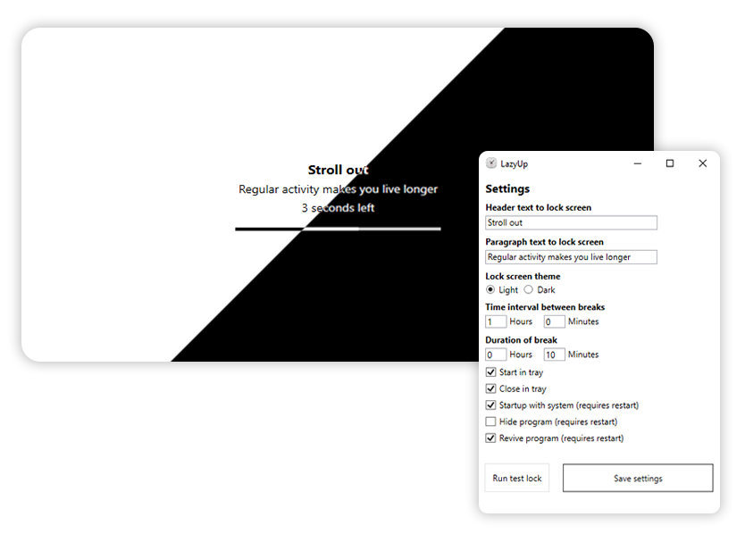

# LazyUp
**Makes you move.**
## About
Strict program, does not allow you to just close the break window and self, unlike analogues.
Open-source code base.

## Instruments
- VisualStudio 2022  
- .NET 6
- WPF & WinForms
- C#, XAML
- Built by nuget 6

## How to try
1. Open [Release](https://github.com/bakhtyiar/LazyUp/releases) section on the repository page. 
2. Download suitable for your system variant. 
3. Unzip it. 
4. Run "LazyUp" binary (.exe, ...) file.